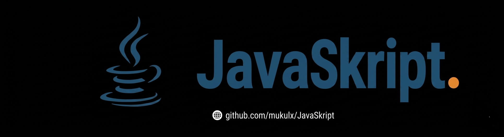

<p align="center">
  
</p>

# JavaSkript

JavaSkript is a Minecraft plugin for Paper and Folia which allows server owners and developers to customize their servers using standard Java without the overhead of creating full plugin projects. It is useful for both rapid prototyping and production server mechanics: write clean `.java` scripts that compile in memory and reload live on your server.

Unlike traditional scripting languages, JavaSkript compiles your code directly into native JVM bytecode in memory using the Eclipse Compiler for Java (ECJ), providing raw Java execution speed with zero interpreter lag.

## Requirements

JavaSkript requires Paper or Folia to work. You heard it right, Spigot and CraftBukkit do not work.

Java 21 or higher is required.

## Downloads

You can find the downloads for each version with their release notes in the [releases page](https://github.com/mukulx/JavaSkript/releases).

## Documentation

Documentation, tutorials, and examples are available in the [`docs/`](docs/) directory:

- [API Reference](docs/API.md) - Reference guide for all 24 built-in subsystems and static facades.
- [Quick Start](docs/QUICKSTART.md) - 5-minute setup and walkthrough.
- [Tutorial](docs/TUTORIAL.md) - Step-by-step guide to writing scripts from scratch.
- [Examples](docs/EXAMPLES.md) - Code examples and patterns for common server mechanics.
- [Dynamic Dependencies](docs/DEPENDENCIES.md) - Loading external Maven libraries directly in scripts.
- [Commands Guide](docs/COMMAND_REGISTRATION.md) - Registering runtime commands and tab-completions.
- [Multiple Classes](docs/MULTIPLE_CLASSES.md) - Structuring scripts with multiple classes per file.
- [Performance & Profiler](docs/PERFORMANCE.md) - Profiler commands and optimization techniques.
- [Troubleshooting](docs/TROUBLESHOOTING.md) - Diagnostics and clean stack trace configuration.
- [Folia Guide](docs/FOLIA.md) - Regional multithreading guidelines and best practices.
- [Lifecycle](docs/LIFECYCLE.md) - Classloading, reload safety, and memory management.
- [Changelog](docs/CHANGELOG.md) - Version history and changes.

## Reporting Issues

Please see our [contribution guidelines](CONTRIBUTING.md) before reporting issues. When reporting a bug, please include:
- Your server software and exact version (Paper or Folia)
- JavaSkript version (`/js info`)
- The script code causing the issue
- Relevant console error logs

## A Note About Add-ons

JavaSkript provides an open addon framework and static API gateway (`JavaSkript.getAPI()`) allowing third-party plugin developers to register custom addons and field injectors. Please note that there are no public or official add-ons available as of now. You can view any registered addons on your server using `/js addons`.

## Compiling

JavaSkript uses Gradle for compilation. Use your command prompt of preference and navigate to JavaSkript's source directory. Then you can just call Gradle to compile and package JavaSkript for you:

```bash
./gradlew clean build shadowJar # on UNIX-based systems (mac, linux)
gradlew.bat clean build shadowJar # on Windows
```

The compiled jar will be located in `build/libs/JavaSkript-2.0.0.jar`.

## Maven Repository

If you use JavaSkript as a dependency or build addons for it using Gradle or Maven:

### Gradle (Groovy DSL)
```groovy
repositories {
    mavenCentral()
    maven {
        url 'https://jitpack.io'
    }
}

dependencies {
    compileOnly 'com.github.mukulx:JavaSkript:2.0.0'
}
```

### Gradle (Kotlin DSL)
```kotlin
repositories {
    mavenCentral()
    maven("https://jitpack.io")
}

dependencies {
    compileOnly("com.github.mukulx:JavaSkript:2.0.0")
}
```

### Maven
```xml
<repositories>
    <repository>
        <id>jitpack.io</id>
        <url>https://jitpack.io</url>
    </repository>
</repositories>

<dependencies>
    <dependency>
        <groupId>com.github.mukulx</groupId>
        <artifactId>JavaSkript</artifactId>
        <version>2.0.0</version>
        <scope>provided</scope>
    </dependency>
</dependencies>
```

## Contributing

Contributions are welcome! Please review [CONTRIBUTING.md](CONTRIBUTING.md) before submitting pull requests.

## License

GNU General Public License v3.0 - see [LICENSE](LICENSE) for details.
